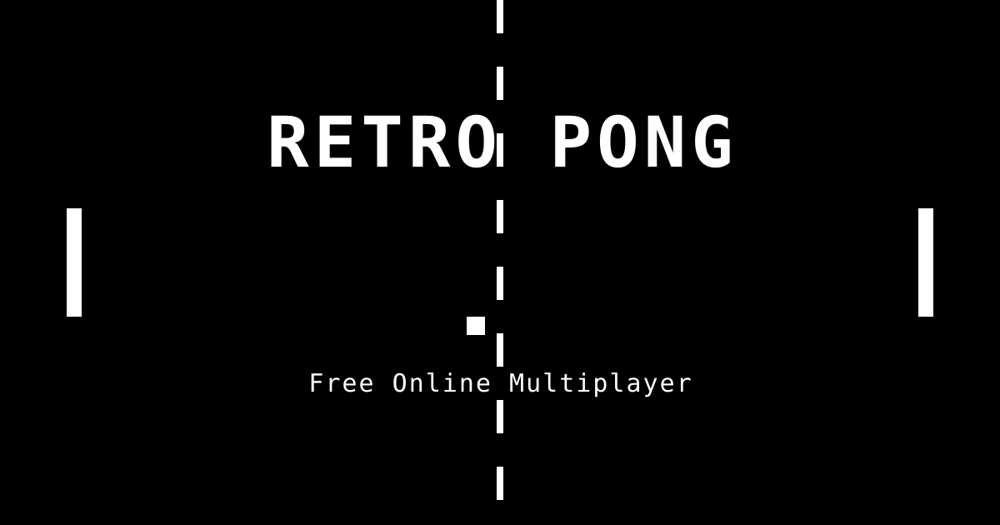

# Retro Pong

A real-time online multiplayer **Pong** game with a retro black-and-white CRT
aesthetic. Players are auto-matched against random opponents and race to 7
points. A persistent leaderboard tracks registered players across all sessions,
and there's a fully offline **vs Computer** mode with three difficulty levels.



## Features

- **Real-time multiplayer** over WebSockets, with the server authoritative for
  ball position and score and client-side prediction for your own paddle.
- **Auto-matchmaking** — click Play, get paired with the next player in the queue.
- **Persistent leaderboard** (PostgreSQL) ranking registered players by points.
- **Guest play** with no sign-up; register to save stats and appear on the board.
- **vs Computer mode** (Easy / Medium / Hard) running entirely client-side.
- **Reconnect handling** — a 10-second window to rejoin a dropped game.
- **CRT visual treatment** — scanlines, vignette, flicker, and a pixel font.
- **SEO-friendly** single page: semantic HTML, Open Graph / Twitter cards,
  JSON-LD `VideoGame` structured data, `robots.txt`, and `sitemap.xml`.

## Tech stack

| Layer    | Choice                                              |
| -------- | --------------------------------------------------- |
| Backend  | Node.js + `ws` WebSocket server (no web framework)  |
| Frontend | Vanilla HTML / CSS / JS, single page                |
| Database | PostgreSQL                                          |
| Auth     | `bcryptjs` password hashing + JWT tokens            |
| Hosting  | Railway (app + Postgres in one project)             |

> Note: `bcryptjs` (pure JS) is used instead of the native `bcrypt` module so
> the app builds and deploys cleanly on Railway with no native toolchain. It is
> API-compatible and uses the same configurable salt rounds (12 here).

## Local development

```bash
# 1. Install dependencies
npm install

# 2. Configure environment
cp .env.example .env
#    then edit .env: set DATABASE_URL to a local Postgres database and
#    set a JWT_SECRET (generate one with the command in .env.example)

# 3. Start the server (runs DB migrations automatically on boot)
npm start

# 4. Open http://localhost:3000
```

You need a running PostgreSQL instance for local play. The `users` and `games`
tables are created automatically on startup.

## Project structure

```
server/
  index.js       HTTP + WebSocket server, REST API, static file serving
  game.js        authoritative game loop, ball physics, collisions, forfeits
  matchmaker.js  queue management and player pairing
  db.js          PostgreSQL connection, migrations, queries, leaderboard
  auth.js        register / login, bcrypt hashing, JWT
client/
  index.html     single page with all SEO/meta tags
  style.css      all styles, including the CRT effects
  game.js        canvas rendering, input, WebSocket client, vs-Computer loop
  ui.js          screens, modals, auth UI, leaderboard rendering
  engine.js      shared physics + the offline AI (mirrors server constants)
  og-image.svg   social share image
robots.txt
sitemap.xml
.env.example
```

## Environment variables

| Variable       | Description                                                  |
| -------------- | ------------------------------------------------------------ |
| `DATABASE_URL` | PostgreSQL connection string (provided by Railway's plugin). |
| `JWT_SECRET`   | Secret used to sign auth tokens. Use a long random string.   |
| `PORT`         | Port to listen on (Railway sets this automatically).         |
| `BASE_URL`     | Public URL, used for canonical/OG tags and the sitemap.      |

## Deployment (Railway)

1. Create a Railway project and add a **PostgreSQL** plugin.
2. Add a service from this GitHub repo. The start command is `npm start`.
3. Set `JWT_SECRET` and `BASE_URL` in the service variables. `DATABASE_URL` and
   `PORT` are provided automatically by Railway.
4. Deploy. Migrations run on startup; the health check is `GET /health`.

After deploying, update the canonical / Open Graph URLs in `client/index.html`
(and `robots.txt` / `sitemap.xml`) to your real domain.

## Gameplay

- First to **7 points** wins.
- **Left paddle:** `W` (up) / `S` (down). **Right paddle:** `↑` / `↓`.
- The ball speeds up with each paddle hit and resets after every point.
- Where the ball hits the paddle determines the rebound angle.

## License

MIT
